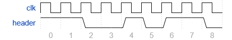

# RMT-Manchester-Library

- [About](#about)
- [Installation](#installation)
- [Usage](#usage)
- [Support](#support)
- [License](#license)
- [More information](#more-information)

## About

RMT-Manchester-Library is an ESP-IDF library that implements Manchester line encoding utilizing the Remote Control Transceiver (RMT) peripheral of the ESP32 serie of microcontrollers. The library exposes the transmitter and receiver. The library implements two baud rates: 20 kBd and 50 kBd. Both baud rates have been tested to be working error-free even in non-ideal conditions.

## Installation

Drag and drop the directory `manch_rmt_rx` or `manch_rmt_tx` to the directory where your libraries are installed. The directory to drag and drop depends if the MCU will be used as a transmitter or a receiver. To change the GPIO used for transmitting or receiving, modify the corresponding macro on the header file.

## Usage

A basic usage example is shown in the next subsection.

### Transmitter

```c
#include "manch_rmt_tx.h"

static const char *TAG = "main";

void app_main(void) {
    ESP_LOGI(TAG, "started");

    // Initialize RMT
    manch_rmt_tx_init();

    // Initialize something else ...

    ESP_LOGI(TAG, "super loop mode");

    const char message_one[] = "Manch";
    const char messsage_two[] = "RMT";
    const char message_three[] = "Module Test";

    while (1) {
        
        manch_rmt_tx_transmit((const uint8_t*)message_one, sizeof(message_one) / sizeof(char) );
        vTaskDelay(pdMS_TO_TICKS(20));
        
        manch_rmt_tx_transmit((const uint8_t*)messsage_two, sizeof(messsage_two) / sizeof(char));
        vTaskDelay(pdMS_TO_TICKS(20));
        
        manch_rmt_tx_transmit((const uint8_t*)message_three, sizeof(message_three) / sizeof(char));
        vTaskDelay(pdMS_TO_TICKS(20));
        
        // Do something else ...

    }
}
```

### Receiver

```c
#include "manch_rmt_rx.h"

static const char *TAG = "main";

void work_with_val(uint8_t *packet) {
    // Do something with the received data..

    if (packet == NULL) {
        return;
    }

    for (size_t idx = 0; idx < 10; idx++) {
        printf("%02x ", packet[idx]);
    }

}

void app_main(void) {
    ESP_LOGI(TAG, "started");

    // Initialize RMT
    ESP_ERROR_CHECK(manch_rmt_rx_init());

    // Initialize something else ...

    ESP_LOGI(TAG, "super loop mode");

    while (1) {
        if (manch_rmt_rx_check_for_data()) {    // This function blocks
            uint8_t *ret_val;

            while (manch_rmt_rx_retr_val(&ret_val)) {
                work_with_val(ret_val);
            }

            // Do something else ...
            
        }

        // Do something else ...
    }
}
```

## Support

For support or submitting bugs open an issue, I'll check them as soon as I am available.

## License

RMT-Manchester-Library is licensed under the [MIT](./LICENSE) license.

## More Information

A custom protocol is implemented on top of the communication that has the header showed in the next figure. The custom protocol, along with certain limitations with the RMT driver, only allow packets of up to 80 bits (10 bytes) to be transmitted at once.


