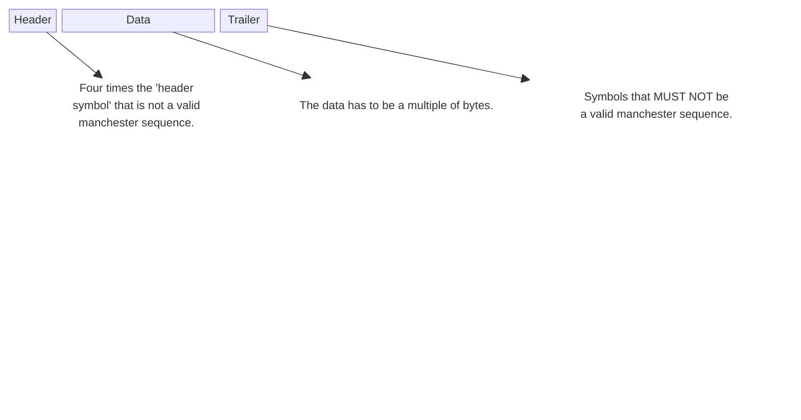
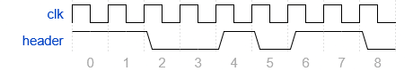

### Manchester RMT RX Module

Made for receiving Manchester-encoded data using the RMT module of the ESP32 microcontrollers. A custom protocol
is set on top of the manchester symbols so the data can be received without major problems; the protocol is as follows:

### Header symbol:

